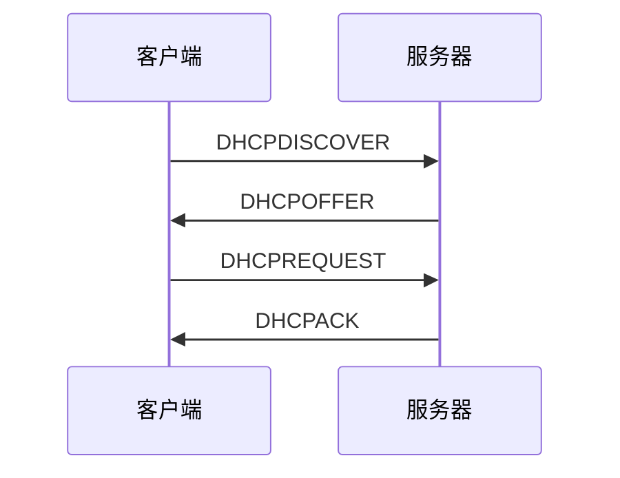

---
# 当前页面内容标题
title: DHCP 协议
# sidebar: heading
# 当前页面图标
icon: note
# 分类
category:
    - 网络层
    - 协议
tag:
    - DHCP
sticky: false
# 是否收藏在博客主题的文章列表中，当填入数字时，数字越大，排名越靠前。
star: false
# 是否将该文章添加至文章列表中
article: true
# 是否将该文章添加至时间线中
timeline: true
# sidebar: heading
order: 4
date: 2022-12-30
# 浏览量
pageview: trues
---

# 📖 什么是dhcp协议

在 TCP/IP 模型中，DHCP 属于网络层（Network Layer）。它主要负责分配 IP 地址和其他网络参数，使得设备能够连接到网络并进行通信。

具体来说，DHCP 在网络层与数据链路层（Link Layer）之间进行工作。它向设备发送控制报文，并接收设备的应答报文，从而实现对设备的网络参数配置。

DHCP使用UDP协议进行通信，其使用的端口是67（服务器端口）和68（客户端端口）。

在网络层中，DHCP 与其他协议如 IPv4 和 IPv6 一起工作，为设备提供 IP 地址和其他必要的网络参数。这些参数可以让设备在网络中的位置唯一确定，并与其他设备进行通信。

| 字段名称                | 字节数   | 功能           | C 变量类型              |
| ----------------------- | -------- | -------------- | ----------------------- |
| Opcode                  | 1        | 操作码         | unsigned char           |
| Hardware Type           | 1        | 硬件类型       | unsigned char           |
| Hardware Length         | 1        | 硬件地址长度   | unsigned char           |
| Hops                    | 1        | 跳数           | unsigned char           |
| Transaction ID          | 4        | 传输 ID        | unsigned long           |
| Seconds                 | 2        | 秒数           | unsigned short          |
| Flags                   | 2        | 标志           | unsigned short          |
| Client IP               | 4        | 客户端 IP 地址 | unsigned long           |
| Your IP                 | 4        | 本地 IP 地址   | unsigned long           |
| Server IP               | 4        | 服务器 IP 地址 | unsigned long           |
| Gateway IP              | 4        | 网关 IP 地址   | unsigned long           |
| Client Hardware Address | 16       | 客户端硬件地址 | unsigned char[16]       |
| Server Name             | 64       | 服务器名称     | char[64]                |
| Boot File Name          | 128      | 引导文件名称   | char[128]               |
| Option                  | variable | 选项           | unsigned char[variable] |

## 📑 工作原理

下面是 DHCP 的工作流程：	

通信流程是指客户端和服务器之间进行交互的过程，它包括以下几个步骤：

1. 客户端发送 DHCPDISCOVER 报文，表示希望获取 IP 地址。
2. 服务器收到 DHCPDISCOVER 报文后，发送 DHCPOFFER 报文，表示同意分配 IP 地址。
3. 客户端收到 DHCPOFFER 报文后，发送 DHCPREQUEST 报文，表示选择某一个 IP 地址作为自己的地址。
4. 服务器收到 DHCPREQUEST 报文后，发送 DHCPACK 报文，表示同意分配 IP 地址。

以上就是 DHCP 协议的通信流程，它是客户端和服务器之间进行交互的关键流程

### 📑 报文类型

具体来说，可以将这些报文类型分成两大类：

1. 客户端发送的报文：包括 DHCPDISCOVER、DHCPREQUEST 等报文。
2. 服务器发送的报文：包括 DHCPOFFER、DHCPACK 等报文。

接下来，可以逐一介绍这些报文类型，并分析它们在 DHCP 协议中的作用。

- DHCPOFFER 报文：是服务器发送给客户端的报文，表示服务器同意为客户端分配某一个 IP 地址。
- DHCPREQUEST 报文：是客户端发送给服务器的报文，表示客户端选择某一个 IP 地址作为自己的地址。
- DHCPACK 报文：是服务器发送给客户端的报文，表示服务器同意分配某一个 IP 地址给客户端。

## 📑 应用场景

DHCP 通常用于局域网环境，例如家庭网络、小型企业网络等。它可以自动分配网络参数，省去了人工手动配置的麻烦。

同时，DHCP 还具有自动释放超时 IP 地址的功能。当设备不再使用 DHCP 分配的 IP 地址时，DHCP 服务器会自动将这个地址释放，以便其他设备使用。

## 📑 安全风险

尽管 DHCP 可以为网络用户提供方便，但它也存在一定的安全风险。

首先，由于 DHCP 是基于 UDP 协议的，因此不能保证数据传输的完整性和可靠性。这意味着，在传输过程中可能会丢失数据包，从而导致配置错误。

其次，DHCP 存在欺骗攻击的风险。攻击者可以冒充 DHCP 服务器，向设备发送伪造的 DHCP 应答报文，从而获取控制权。

## 📑 防范措施

对于 DHCP 服务器，应该采取如下措施来防范安全风险：

- 配置安全策略：可以配置 DHCP 服务器的安全策略，例如禁用未经认证的客户端，只允许已经认证的设备使用 DHCP 服务。
- 使用加密技术：可以使用加密技术，例如 SSL/TLS，来加密 DHCP 报文的传输。这样可以防止攻击者窃取数据。

对于设备，应该采取如下措施来防范安全风险：

- 使用防火墙：可以使用防火墙来保护设备，防止攻击者伪装 DHCP 服务器并发送伪造的 DHCP 应答报文。
- 使用认证机制：可以使用认证机制，例如认证服务器或者密码认证，来保护设备。这样可以确保只有认证过的设备才能使用 DHCP 服务。

## 📑 小结

DHCP 是一种协议，用于在局域网中自动配置网络参数。它的工作原理是，当新的设备连接到网络时，向 DHCP 服务器发送“DHCP 请求”报文，服务器收到请求后会分配 IP 地址并向设备发送“DHCP 应答”报文。DHCP 通常用于局域网环境，具有自动分配网络参数和自动释放超时 IP 地址的功能。它也存在一定的安全风险，但可以通过设置白名单和使用加密技术等方法来解决。未来，DHCP 可能会添加新的功能和安全
