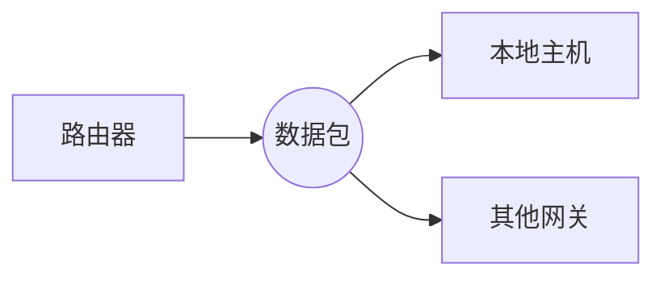

---
# 当前页面内容标题
title: IP 协议
# sidebar: heading
# 当前页面图标
icon: note
# 分类
category:
    - 网络层
    - 协议
tag:
    - IP    
sticky: false
# 是否收藏在博客主题的文章列表中，当填入数字时，数字越大，排名越靠前。
star: false
# 是否将该文章添加至文章列表中
article: true
# 是否将该文章添加至时间线中
timeline: true
# sidebar: heading
order: 3
date: 2023-01-04
# 浏览量
pageview: true
---

# 📖 什么是IP协议？

IP协议（Internet Protocol）是互联网的基础协议   之一，它负责在网络中传输数据包。

IP协议是一种面向数据包的协议，它通过在数据包头部添加协议头来封装数据，然后通过网络层协议（如ICMP或IGMP）将数据包发送出去。 每个数据包都包含了源地址（即发送主机的IP地址）和目标地址（即接收主机的IP地址），并由路由器根据目标地址决定如何转发数据包。

IP协议还规定了如何分片和重组数据包，以应对带宽有限的网络环境。 如果一个数据包太大而无法通过某条链路传输，则可以将数据包分为多个较小的数据包（称为分片），并在每个数据包中添加额外的信息（如序号和标记）来表示它们的顺序和属于哪个数据包。 接收主机收到所有分片后，会根据额外信息将它们重新组合成原来的数据包。

## 📑 字段结构

| 字段名       | 比特 | 描述                                 |
| ------------ | ---- | ------------------------------------ |
| Version      | 4    | 表示IP协议的版本号                   |
| Hdr Len      | 4    | 表示协议头的长度                     |
| Srv Type     | 8    | 表示数据包的优先级和服务质量         |
| Tot Len      | 16   | 表示数据包的总长度                   |
| ID           | 16   | 用于标记分片的数据包                 |
| Flags        | 3    | 用于标记分片的数据包                 |
| Frag Offset  | 13   | 表示分片在原来的数据包中的位置       |
| Time To Live | 8    | 表示数据包可以在网络中存在的最长时间 |
| Protocol            | 8    | 表示数据包使用的上层协议 |
| Header Checksum     | 16   | 用于检查协议头中的错误   |
| Source Address      | 32   | 表示发送主机的IP地址     |
| Destination Address | 32   | 表示接收主机的IP地址     |
| Option (非必要) | 0~40 | 用于在IP数据包中包含额外的信息 |

### 📑 Protocol 字段值列表

| Protocol 值 | 描述                                                 |
| ----------- | ---------------------------------------------------- |
| 0x00        | 预留，用于本地网络                                   |
| 0x01        | ICMP（Internet Control Message Protocol）            |
| 0x02        | IGMP（Internet Group Management Protocol）           |
| 0x03        | GGP（Gateway-to-Gateway Protocol）                   |
| 0x04        | IP in IP (encapsulation)                             |
| 0x06        | TCP（Transmission Control Protocol）                 |
| 0x08        | EGP（Exterior Gateway Protocol）                     |
| 0x09        | IGRP（Interior Gateway Protocol）                    |
| 0x0C        | PUP（PARC Universal Packet Protocol）                |
| 0x11        | UDP（User Datagram Protocol）                        |
| 0x14        | HMP（Host Monitoring Protocol）                      |
| 0x1B        | RDP（Reliable Data Protocol）                        |
| 0x1C        | IRTP（Internet Reliable Transaction Protocol）       |
| 0x29        | IPv6（Internet Protocol version 6）                  |
| 0x2E        | RSVP（Resource Reservation Protocol）                |
| 0x32        | ESP（Encapsulating Security Payload）                |
| 0x33        | AH（Authentication Header）                          |
| 0x3A        | ICMPv6（Internet Control Message Protocol for IPv6） |
| 0x3B        | No Next Header（IPv6中没有下一个头）                 |
| 0x3C        | Destination Options                                  |

## 📑 工作原理

当一台主机想要向另一台主机发送数据时，它会将数据封装成数据包，并在数据包头部添加IP协议头。 IP协议头包含了源地址和目标地址，并由路由器根据目标地址决定如何转发数据包。

如果目标地址在本地网络内，则路由器会将数据包转发给目标主机。 如果目标地址在其他网络中，则路由器会将数据包转发给其他网关。

数据包按照这种方式在网络中传输，直到到达目标地址。 接收主机收到数据包后，会检查IP协议头，并根据目标地址判断是否是自己的数据包。 如果是自己的数据包，则主机会将数据包交给上层协议（如TCP或UDP）处理。

如果一个数据包太大而无法通过某条链路传输，则可以将数据包分片成多个较小的数据包，并在每个数据包中添加额外的信息来表示它们的顺序和属于哪个数据包。 接收主机收到所有分片后，会根据额外信息将它们重新组合成原来的数据包。

## 📑 小结

IP协议是互联网中不可或缺的一部分，它负责在网络中传输数据包。 IP协议头包含了源地址和目标地址，
