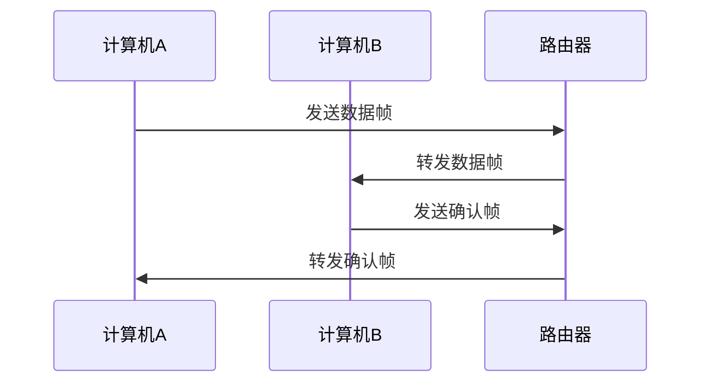

---
# 当前页面内容标题
title: MAC 协议
# sidebar: heading
# 当前页面图标
icon: note
# 分类
category:
    - 数据链路层
    - 协议
tag:
    - MAC
sticky: false
# 是否收藏在博客主题的文章列表中，当填入数字时，数字越大，排名越靠前。
star: false
# 是否将该文章添加至文章列表中
article: true
# 是否将该文章添加至时间线中
timeline: true
# sidebar: heading
order: 1
date: 2023-01-02
# 浏览量
pageview: true
---

# 📖 什么是 MAC 协议

在计算机网络中，MAC (Media Access Control) 协议是与网络媒体交互的协议。它的主要功能是确定在局域网中的计算机如何交换数据，也就是确定在局域网中的计算机如何访问网络媒体。

## 📑 字段结构

以太网协议的帧结构如下：

| 字段名称                 | 字节    | 功能          | C 变量类型       |
| ------------------------ | ------- | ------------- | ---------------- |
| Destionation MAC Address | 6       | 目的 MAC 地址 | unsigned char[6] |
| Source MAC Address       | 6       | 源 MAC 地址   | unsigned char[6] |
| Ethernet Type            | 2       | 以太网类型    | unsigned short   |
| Data                     | 46-1500 | 数据          | unsigned char[]  |

在 MAC 协议中，并没有校验和这一字段。通常情况下，在 MAC 层的数据传输过程中，会使用 FCS (Frame Check Sequence) 来进行数据的校验。FCS 是在 MAC 帧的末尾添加的一个字段，其中包含了一个数据的校验值，用来校验数据的完整性。

在 MAC 协议的结构中，FCS 通常会被当作数据的一部分来处理，因此在表格中并不会单独列出。你可以将 FCS 看作是 MAC 协议中的一个隐藏字段，它并不会显式地出现在 MAC 协议的结构中。

### 📑 以太网类型

在 MAC 协议中，以太网类型字段是用来指明这一帧数据的类型。在以太网中，类型是指这一帧数据的上层协议类型，如 IP 协议、ARP 协议、RARP 协议等。在 MAC 协议中，类型字段是使用 16 位二进制表示的。

| 类型(Hex) | 协议                             |
| --------- | -------------------------------- |
| 0x0800    | IP 协议                          |
| 0x8035    | RARP 协议                        |
| 0x809B    | AppleTalk 协议                   |
| 0x8137    | Novell IPX 协议                  |
| 0x8138    | Novell                           |
| 0x8204    | VLAN-tagged frame (IEEE 802.1Q)  |
| 0x8235    | VLAN-tagged frame (IEEE 802.1ad) |
| 0x86DD    | IPv6 协议                        |

## 📑 工作原理

在 MAC 协议下，每台计算机都有一个独特的 MAC 地址，这个地址在出厂时就已经写入计算机的网卡中。当计算机要与另一台计算机通信时，会先使用 ARP 协议将目的地址解析为 MAC 地址，然后再使用 MAC 协议将数据帧传输到目的地。

具体流程如下：

从上面的流程可以看出，MAC 协议的作用是在两台计算机之间传输数据帧，而 ARP 协议的作用是将 IP 地址解析为 MAC 地址

## 📑 小结

以太网帧格式中的源 MAC 地址和目的 MAC 地址字段分别用来表示发送端和接收端的 MAC 地址。MAC 地址是使用 48 位二进制表示的。

以太网帧格式中的数据字段用来存储上层协议传递的数据。数据字段的大小是可变的，最小为 46 字节，最大为 1500 字节。