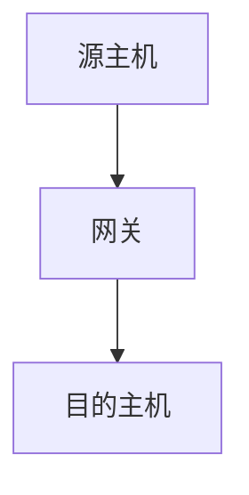
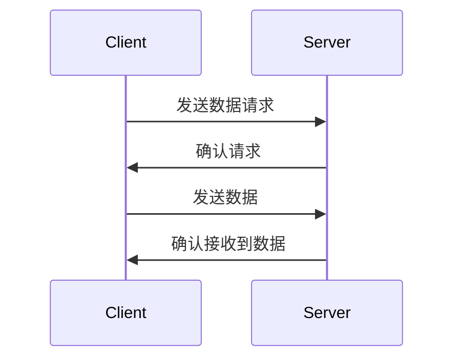
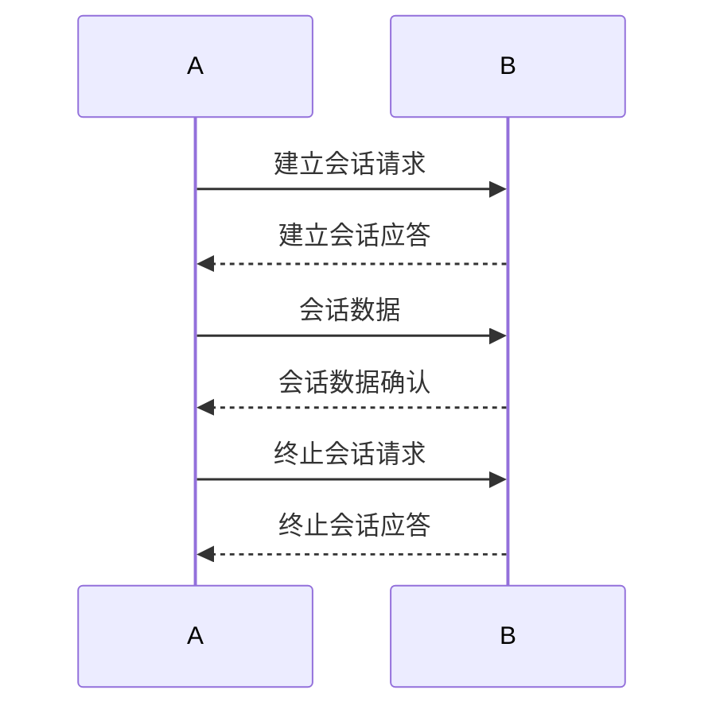
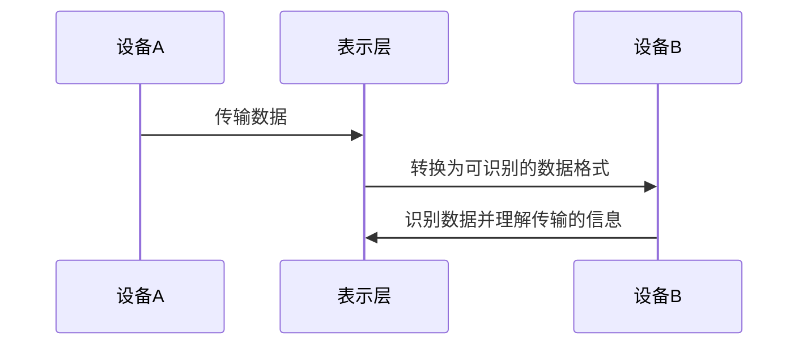
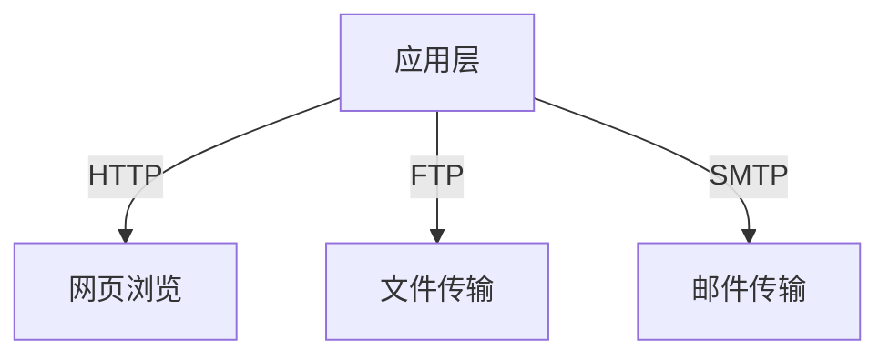

---
# 当前页面内容标题
title: OSI七层模型
# sidebar: heading
# 当前页面图标
icon: note
# 分类
category:
    - 模型
tag:
    - OSI
sticky: false
# 是否收藏在博客主题的文章列表中，当填入数字时，数字越大，排名越靠前。
star: false
# 是否将该文章添加至文章列表中
article: true
# 是否将该文章添加至时间线中
timeline: true
# sidebar: heading
order: 1
date: 2022-12-30
# 浏览量
pageview: true

---

# 📝 OSI七层模型 

OSI七层模型是一种用于描述网络模型的结构。它包括七个分层：物理层、数据链路层、网络层、传输层、会话层、表示层和应用层。每一层都有自己的功能和协议。下面是OSI七层模型的详细描述：

| 层         | 作用                                                         | 常见协议                                          |
| ---------- | ------------------------------------------------------------ | ------------------------------------------------- |
| 物理层     | 负责网络硬件的交互。它描述了如何连接网络设备和传输数据。     | Ethernet、Wi-Fi、Bluetooth、RS-232、Fiber Channel |
| 数据链路层 | 负责在网络设备之间传输数据。它规定了如何在网络中传输数据帧。 | Ethernet、Wi-Fi、FDDI、ATM、Frame Relay、PPP      |
| 网络层     | 负责在网络中传输数据包。它规定了如何在网络中寻址并路由数据包。 | IP、IPv6、ICMP、IGMP、OSPF、BGP                   |
| 传输层     | 负责在两台计算机之间传输数据。它规定了如何建立、维护和终止连接。 | TCP、UDP、SCTP、DCCP                              |
| 会话层     | 负责在两台计算机之间建立、维护和终止会话。它确保数据在会话中按顺序传输。 | Telnet、SSH、RPC、SQL                             |
| 表示层     | 负责将数据转换为适合传输的格式。它规定了如何表示数据以及如何将其编码和解码。 | ASCII、Unicode、JPEG、MPEG、PNG                   |
| 应用层     | 主要负责为应用程序提供与网络通信的接口                       | HTTP、HTTPS、SMTP、POP3、IMAP、DNS等              |

## 📝 物理层

OSI物理层（Physical Layer）是网络模型中最基础的一层，它负责定义网络设备之间如何通信，以及数据在网络中如何传输。

物理层包括电气特性、物理连接和传输介质三个方面：

- 电气特性：指定了设备之间电气信号的传输特性，包括电压、频率、信号的形态等。
- 物理连接：指定了设备之间如何连接，包括接口类型、连接方式、电缆类型等。
- 传输介质：指定了数据在网络中的传输介质，包括有线和无线的传输介质。

物理层所支持的协议有以下几种：

- EIA/TIA-232：支持点对点通信，常用于串口通信。
- EIA/TIA-449：支持点对点通信，常用于串口通信。
- V.24：支持点对点通信，常用于串口通信。
- X.21：支持点对点通信，常用于串口通信。
- V.35：支持点对点通信，常用于数据通

## 📝 数据链路层

OSI的数据链路层负责在两个相邻设备之间传输数据帧。它使用有线或无线技术来传输数据帧，并提供错误检测和确认功能。

数据链路层包含的协议有以太网、Wi-Fi、ATM和Frame Relay。

常见的数据链路层功能有：

- 解析和确定目的地和源地址，以确定数据帧的发送方向
- 利用流控制和访问控制机制确保在拥塞的情况下有效地传输数据帧
- 在两个设备之间创建逻辑链接，以确保数据帧的传输

## 📝 网络层

网络层负责在不同网络之间传输数据包，它主要解决的是路由问题。网络层使用路由协议来确定数据包应该流向哪里，使用分组交换技术在网络之间传输数据。

网络层提供了网络到网络之间的通信，并且能够处理路由问题。它的主要功能包括：

- 路由选择：选择最优路径，将数据包发送到目的地。
- 地址解析：解析数据包的源地址和目的地址。
- 分组交换：使用分组交换技术在网络之间传输数据。

常见的网络层协议包括：

- IP（Internet Protocol）：负责在网络之间传输数据包。
- ARP（Address Resolution Protocol）：负责在网络中将 IP 地址映射到物理地址（MAC 地址）。

## 📝传输层

传输层负责在两台计算机之间建立可靠的连接，以确保在传输数据时不会丢失数据包。它还负责处理传输过程中可能出现的错误，并确保数据包按顺序到达目的地。

传输层包含两个主要协议：TCP和UDP。

TCP（传输控制协议）负责建立可靠的连接，并确保数据包按顺序到达目的地。它通过三次握手建立连接，并使用确认和重传机制确保数据的可靠性。

UDP（用户数据报协议）不建立连接，直接发送数据包。它适用于对延迟要求较低的应用，因为它没有确认和重传的机制。

## 📝 会话层

OSI的会话层的主要作用是管理两台计算机之间的会话。它负责建立、维护和终止会话。会话层主要使用会话层协议来实现这些功能，例如，NETBIOS和SMB协议。

会话层的主要协议有：

| 协议    | 描述                                 |
| ------- | ------------------------------------ |
| NETBIOS | 在局域网内的计算机之间进行通信的协议 |
| SMB     | 用于在计算机之间共享文件的协议       |

## 📝 表示层

在OSI模型中，表示层主要负责在不同的设备之间交换数据时的翻译，确保各个设备能够正确地识别和理解传输的数据。表示层的主要功能是将数据表示为不同的格式，使得传输的数据能够在各种不同的网络和设备之间传输。

表示层主要使用的协议包括：

- ASCII：American Standard Code for Information Interchange，美国信息交换标准代码，用于表示文本数据。
- EBCDIC：Extended Binary Coded Decimal Interchange Code，扩展二进制编码十进制交换码，用于在主机之间交换数据。
- Unicode：用于表示多种语言的字符集。

## 📝 应用层

OSI的应用层负责为应用程序提供网络服务。它定义了应用程序如何与网络通信，以及如何处理网络信息。OSI的应用层包含了许多协议，如 HTTP、FTP、SMTP 等。

在应用层中，应用程序通过协议与其他应用程序进行通信。例如，当一个用户使用浏览器访问网站时，浏览器会使用 HTTP 协议与服务器进行通信。同时，当一个用户使用 FTP 客户端下载文件时，FTP 协议也会被使用。

应用层为应用程序提供了与网络进行通信的所有必要机制。它定义了如何处理网络信息，以及如何在应用程序之间传输数据。

具体的，应用层包含了以下协议：

| 协议   | 用途                                        |
| ------ | ------------------------------------------- |
| HTTP   | 网页浏览                                    |
| FTP    | 文件传输                                    |
| SMTP   | 邮件传输                                    |
| Telnet | 远程登录                                    |
| DNS    | 域名解析                                    |
| NTP    | 网络时间协议                                |
| SNMP   | 网络管理协议                                |
| LDAP   | 光盘服务器协议                              |
| SSH    | 安全的远程登录协议（Secure Shell Protocol） |

