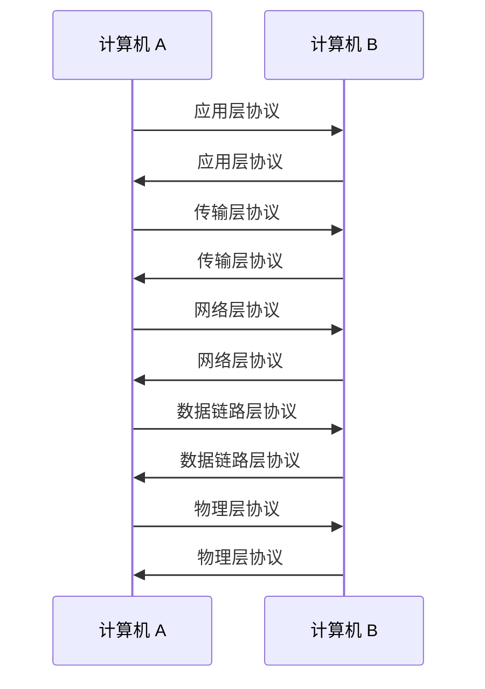

---
# 当前页面内容标题
title: TCP/IP五层模型
# sidebar: heading
# 当前页面图标
icon: note
# 分类
sticky: false
# 是否收藏在博客主题的文章列表中，当填入数字时，数字越大，排名越靠前。
star: false
# 是否将该文章添加至文章列表中
article: true
# 是否将该文章添加至时间线中
timeline: true
# sidebar: heading
order: 2
category:
    - 模型
tag:
    - TCP/IP
date: 2022-12-30
# 浏览量
pageview: true
---

# 🔥TCP/IP协议

TCP/IP 模型（Transmission Control Protocol/Internet Protocol model）是一种网络通信协议，是互联网的基础协议。它是由美国国防部（DARPA）开发的，旨在为军事和政府部门提供一种可靠的通信方式。后来，TCP/IP 模型被广泛应用于商业和民用领域，成为了互联网的基础协议。

## 💡 概念

TCP/IP 模型为网络通信提供了一组规则和标准，使得不同的计算机系统能够互相通信。它包含了两个主要协议：TCP 和 IP。

- TCP (Transmission Control Protocol) 是传输控制协议，主要负责确保数据传输的可靠性和正确性。它通过发送确认消息和重新发送损坏的数据来保证数据的完整性。
- IP (Internet Protocol) 是网际协议，主要负责将数据包传输到目的地。它通过在数据包中包含目的地的 IP 地址来实现这一功能。

## 📐 结构

TCP/IP 模型由五层组成：应用层、传输层、网络层、数据链路层和物理层。

1. 应用层负责为应用程序提供网络通信功能。常见的协议包括 HTTP、FTP、SMTP 等。
2. 传输层负责在两台计算机之间传输数据。常见的协议包括 TCP、UDP。
3. 网络层负责在不同网络之间传输数据。常见的协议包括 IP。
4. 数据链路层负责在同一网络内传输数据。常见的协议包括 Ethernet。
5. 物理层负责在计算机之间传输数据的物理连接。常见的协议包括 HDMI、USB 等。

## 🚀 通信流程

下图使用 mermaid 流程图展示了使用 TCP/IP 协议进行通信的流程：

在进行通信时，每一层协议都会在源计算机和目的计算机之间进行交互。

应用层协议负责提供应用程序所需的网络通信功能。比如，当我们使用浏览器访问网页时，应用层协议就是 HTTP 协议。

传输层协议负责在两台计算机之间传输数据。比如，当我们使用 TCP 协议时，传输层协议就会负责确保数据的可靠传输。

网络层协议负责在不同网络之间传输数据。比如，当我们使用 IP 协议时，网络层协议就会负责将数据包传输到目的地。

数据链路层协议负责在同一网络内传输数据。比如，当我们使用 Ethernet 协议时，数据链路层协议就会负责在计算机之间传输数据。

物理层协议负责在计算机之间传输数据的物理连接。比如，当我们使用 HDMI 协议时，物理层协议就会负责在计算机之间传输数据。

## 📱 应用

TCP/IP 模型在很多领域都有广泛的应用。下面列出了一些典型的应用场景：

1. 互联网：TCP/IP 模型是互联网的基础协议，它使得计算机可以在全球范围内互相通信。
2. 局域网：TCP/IP 模型也可以用于局域网的通信。比如，我们可以使用它来连接多台计算机，共享文件和打印机。
3. 移动通信：TCP/IP 模型在移动通信中也有广泛应用。比如，我们可以使用它来连接手机和网络，实现短信和数据通信。
4. 工业控制系统：TCP/IP 模型也被用于工业控制系统中，用于连接控制设备和监控系统。

## 🌟 特点

TCP/IP 模型具有以下几个特点：

1. 开放性：TCP/IP 模型是一种开放的协议，可以被任何人使用。它不受制于任何公司或组织，因此可以被广泛应用。
2. 兼容性：TCP/IP 模型兼容各种计算机系统，可以在 Windows、Linux、Mac 等操作系统中使用。
3. 可靠性：TCP 协议可以保证数据的可靠传输，使得通信更加可靠。
4. 分层结构：TCP/IP 模型的分层结构使得它更加灵活，可以根据不同的应用场景使用不同的协议。
5. 安全性：TCP/IP 模型支持加密通信，可以保证数据的安全性。

总之，TCP/IP 模型是一种非常重要的网络通信协议，在各个领域都有广泛应用。